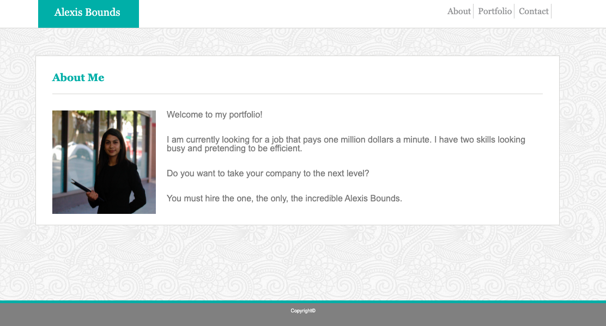
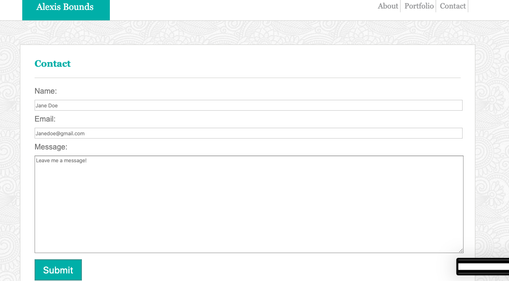

# Basic Portfolio

This site provides an about me, a collection of projects, and a way to contact me.

## Images

## Built With

* [HTML](https://developer.mozilla.org/en-US/docs/Web/HTML)
* [CSS](https://developer.mozilla.org/en-US/docs/Web/CSS)

## Deployed Link

* [See Live Site](https://boundsalexis.github.io/basic-portfolio/)

## Authors

* **Alexis Bounds** 

- [Link to Portfolio Site](https://github.com/boundsalexis/basic-portfolio)
- [Link to Github](https://boundsalexis.github.com/)
- [Link to LinkedIn](https://www.linkedin.com/in/alexis-bounds-9b7711169/)

## License

This project is licensed under the MIT License 

## Acknowledgments

* Hat tip to anyone whose code, libraries, packages, or UI was used  / inspired from
* Inspiration
* Nothing would be possible without W3Schools
